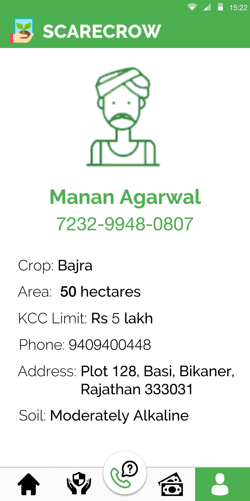
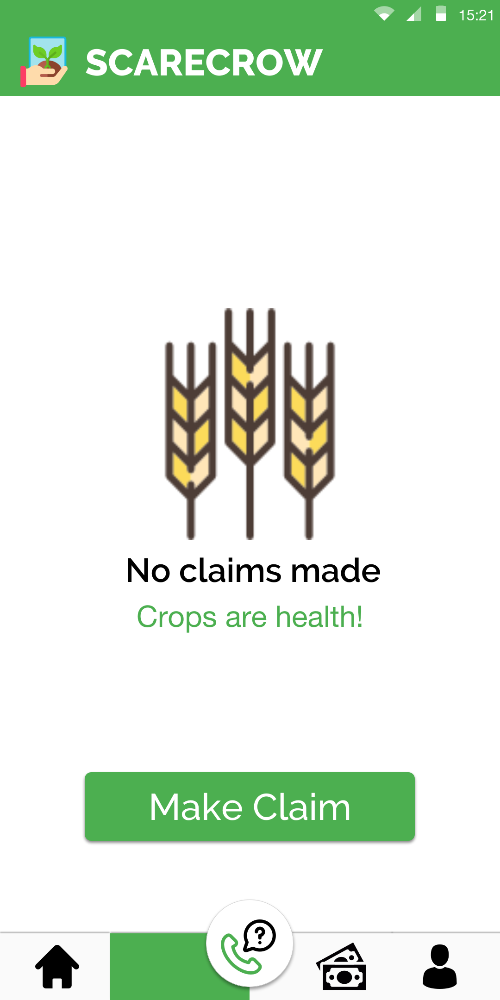

# Scarecrow
### Smart Contract Based Crop Index Insurance
*(This project won the first runners up award at Rajasthan Hackathon 5.0.)*


***A crop insurance system,that, using blockchain and machine learning mitigates the subjectivity of claim verification, thus giving 400 million farmers, the right payout, at the right time.***

Implemented here, is the smart contract and the interaction scripts for an index based crop insurance system written using Solidity and deployed on the Ropsten Ethereum testnet. 

Also, we propose a ML model that is trained on crop, weather and soil data obtained from various sources like the IMD API, Bhuvan and offline sources like CCE experiments. It returns the probability of a certain crop failing. This is sent to the smart contract and on the basis of this data, it decides whether to transfer the payout amount to the farmer.

The SCII smart contract is deployed on the Ropsten Testnet here: https://ropsten.etherscan.io/address/0x59ec0a28bf69958c79ba1e66e09d646c4493f0d7

## Usage
### Install
```script
npm install -g truffle
git clone https://github.com/sidb03/scarecrow.git
```
### Download Ganache here: https://truffleframework.com/ganache

While running Ganache, run these commands inside the cloned directory:
```script
truffle compile
truffle migrate
truffle "./interactions/interactions.js"
```
In order to make changes to the parameters in the function calls to the smart contract, open ./interactions/interactions.js and make changes to the declared variables as necessary.

_The ML model is yet to be implemented. It requires data that is only accessible after a partnership with the Govt._

## Prototype Screens [Live Prototype](www.bit.ly/scarecrowProto)
<p float="left">
  
  
  
</p>
<br/>
<br/>
<p float="left">
  
  
  
</p>


